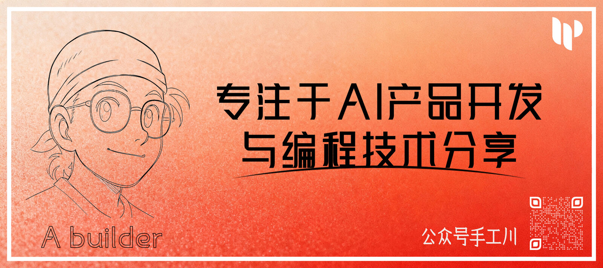

<h1 align="center">Lovstudio General Skills</h1>

<p align="center">
  <strong>Index and install mirror for Lovstudio general AI coding skills for Claude Code.</strong><br>
  <sub>By <a href="https://lovstudio.ai">Lovstudio</a> · <a href="https://agentskills.io">agentskills.io</a></sub>
</p>

<p align="center">
  <a href="README.md">简体中文</a> · <b>English</b>
</p>

<p align="center">
  <a href="#skills">Skills</a> ·
  <a href="#extension-indexes">Extension indexes</a> ·
  <a href="#install">Install</a> ·
  <a href="#how-it-works">How It Works</a> ·
  <a href="#contributing">Contributing</a> ·
  <a href="#license">License</a>
</p>

---

## What Is This

This repo is the index and install mirror for Lovstudio **general skills**, used by
`npx lovstudio skills add general-skills`. Each regular skill lives in its own repo at
`github.com/lovstudio/{name}-skill`; developer tooling, xBTI, and other themed collections are
linked below as extension index repos. The top-level entry point for the full Lovstudio skills
ecosystem is [`lovstudio/skills`](https://github.com/lovstudio/skills).

This repo contains:

- [`skills.yaml`](skills.yaml) — machine-readable manifest. Each skill has a terse `description` (Agent-facing trigger copy, CI-synced from the GitHub repo description) plus hand-maintained `tagline_en` / `tagline_zh` (the human-friendly one-liners you see in the table below).
- [`pricing-cards/`](pricing-cards) — one Pricing Card per Skill, covering the deliverable, public price, value anchor, usage boundary, maintenance trigger, and evidence gaps; the website consumes only the public fields.
- [`README.md`](README.md) / [`README.en.md`](README.en.md) — auto-rendered from the manifest.
- [`skills/`](skills) — installer-facing mirrors. Free skills are synced from their own repos; paid skills only expose public encrypted bundles or placeholders. Source code and history still live in each skill's own repo.

Skills marked  are open source (MIT). Skills marked  are commercial — private repo, purchase required. To purchase or ask questions, scan the QR code to follow the **手工川 (ShougongChuan)** WeChat official account:

<p align="center">
  
</p>

## Skills

<!-- COUNT:START -->
> **44 skills** — 33 Free + 11 Paid.
<!-- COUNT:END -->

<!-- SKILLS:START -->
| | Skill | Description |
|---|---|---|
| **General** | | |
|  | [`fact-check`](https://github.com/lovstudio/fact-check-skill) | Verify claims like a careful researcher, with primary sources, counterexamples, confidence, and next steps. |
|  | [`hanzi-lens`](https://github.com/lovstudio/hanzi-lens-skill) | See one Chinese character through evidence — readings, form, history, classical context, meaning, and a professional visual. — requires: `professional-infographic` |
|  | [`image-creator`](https://github.com/lovstudio/image-creator-skill) | Generate images through the right mechanism — AI, code rendering, or prompt tuning. — related: `professional-infographic`, `professional-portrait` |
|  | [`macos-disk-optimizer`](https://github.com/lovstudio/macos-disk-optimizer-skill) | Clean up Mac storage with guarded planning, archive migration, exact rollback-item purging, and real-capacity verification. |
|  | [`wdb-cli`](https://github.com/lovstudio/wdb-cli-skill) | Find and analyze the WeChat data you need, from familiar records to newly added database structures. — ¥19.9 CNY |
| **Business** | | |
|  | [`bp`](https://github.com/lovstudio/bp-skill) | A composable BP skill kit — use outline, deck, and polish alone or run the complete investor workflow. — requires: `bp-outline`, `bp-deck`, `bp-polish` |
|  | [`bp-deck`](https://github.com/lovstudio/bp-skill) | Turn an approved BP outline into a professional PPTX, PDF, and full-deck preview with deliberate style selection. — requires: `any2deck` |
|  | [`bp-outline`](https://github.com/lovstudio/bp-skill) | Turn project evidence into an investor narrative and a source-backed 12–15 slide outline before making PPT. |
|  | [`bp-polish`](https://github.com/lovstudio/bp-skill) | Audit and polish an existing BP with a scored report and page-level fixes—without changing the facts. |
|  | [`contract-review-pro`](https://github.com/lovstudio/contract-review-pro-skill) | Professional-grade contract review — four-layer methodology, structured comments with risk levels, summary, opinion, and business flowchart. |
|  | [`event-curator`](https://github.com/lovstudio/event-curator-skill) | Turn a guest bio into a ready-to-run event plan — title, rundown, host questions, and gifts. — ¥49.9 CNY |
|  | [`expense-report`](https://github.com/lovstudio/expense-report-skill) | Turn a pile of invoices into a categorized Excel expense report. |
|  | [`proposal`](https://github.com/lovstudio/proposal-skill) | Turn a project brief into a complete, client-ready business proposal. — ¥49.9 CNY |
|  | [`review-doc`](https://github.com/lovstudio/review-doc-skill) | Review contracts like a senior legal expert — comments, redlines, fallback clauses, and negotiation priorities. |
| **Design** | | |
|  | [`business-card`](https://github.com/lovstudio/business-card-skill) | Turn anyone's name, roles and tagline into a polished editorial business card — high-res PNG plus a click-to-download HTML. |
|  | [`event-poster`](https://github.com/lovstudio/event-poster-skill) | Turn an event brief into a polished poster, ready to share or print for exhibitions. — ¥49.9 CNY |
|  | [`find-logo`](https://github.com/lovstudio/find-logo-skill) | Collect brand logos from public sources — wide and transparent preferred, archived for website/PPT/poster lineups. |
|  | [`maintain-partners`](https://github.com/lovstudio/maintain-partners-skill) | Reuse find-logo, normalize assets, and wire partners into the site across 4 locales. — requires: `find-logo` |
|  | [`oh-my-landingpage`](https://github.com/lovstudio/oh-my-landingpage-skill) | Rebuild a landing page as one coherent brand experience, from the promise and story to the interface, media, and conversion path. — ¥19.9 CNY |
|  | [`professional-infographic`](https://github.com/lovstudio/professional-infographic-skill) | Turn dense material into an evidence-led infographic whose topic title, visual proof, tail recommendation, and sources form one clear argument. — related: `image-creator` |
|  | [`professional-portrait`](https://github.com/lovstudio/professional-portrait-skill) | Turn one photo into a clean, identity-preserving professional portrait. — related: `image-creator` |
|  | [`visual-clone`](https://github.com/lovstudio/visual-clone-skill) | Extract the design DNA of a reference image so you can recreate the look. — ¥49.9 CNY |
| **Academic** | | |
|  | [`academic-translator`](https://github.com/lovstudio/academic-translator-skill) | Translate English papers into Chinese while preserving figures, equations, pages, and navigation. — ¥4.99 CNY |
|  | [`thesis-polish`](https://github.com/lovstudio/thesis-polish-skill) | Polish an MBA thesis across language, structure, argument, and originality. |
|  | [`translation-review`](https://github.com/lovstudio/translation-review-skill) | Review a Chinese→English translation against the original across six quality dimensions. |
| **Office Automation** | | |
|  | [`any2deck`](https://github.com/lovstudio/any2deck-skill) | Turn any content into a styled slide deck — 16 looks, export to PPTX or PDF. — related: `any2pdf`, `any2docx` |
|  | [`any2docx`](https://github.com/lovstudio/any2docx-skill) | Convert Markdown into a clean, professionally styled Word document. — related: `any2pdf`, `any2deck` |
|  | [`any2pdf`](https://github.com/lovstudio/any2pdf-skill) | Typeset Markdown into a publication-quality PDF with 14 built-in themes. — related: `any2docx`, `any2deck` |
|  | [`fill-form`](https://github.com/lovstudio/fill-form-skill) | Fill Word (.docx) form templates automatically, with clean CJK typography. |
|  | [`fill-web-form`](https://github.com/lovstudio/fill-web-form-skill) | Answer online forms using your own knowledge base as the source of truth. |
|  | [`pdf2png`](https://github.com/lovstudio/pdf2png-skill) | Convert a PDF to a single long PNG — fast enough to feel instant on macOS. |
|  | [`png2svg`](https://github.com/lovstudio/png2svg-skill) | Convert a PNG to a crisp SVG, with background removed and curves smoothed. |
|  | [`rich-export`](https://github.com/lovstudio/rich-export-skill) | Export one rich-media source into web, editable document, print, and archive formats. |
| **Content Creation** | | |
|  | [`anti-wechat-ai-check`](https://github.com/lovstudio/anti-wechat-ai-check-skill) | Detect AI fingerprints in an article and rewrite it to read like a human. |
|  | [`deep-research`](https://github.com/lovstudio/deep-research-skill) | Produce citation-tracked research reports with persistent evidence, claim verification, and Markdown/HTML/PDF packaging. |
|  | [`document-illustrator`](https://github.com/lovstudio/document-illustrator-skill) | Illustrate a long document in place — plan, generate, and insert images automatically. — requires: `image-creator` |
|  | [`style-clone`](https://github.com/lovstudio/style-clone-skill) | Extract a writing style profile from sample articles, then rewrite any content in that style. |
|  | [`wechat-article-branding`](https://github.com/lovstudio/wechat-article-branding-skill) | Turn a WeChat article into one coherent branded edition with an editorial art cover, centered publisher Logo, reusable prompt, and real-page acceptance. — ¥4.99 CNY — related: `wechat-article-operator` |
|  | [`wechat-article-operator`](https://github.com/lovstudio/wechat-article-operator-skill) | Read and edit an existing WeChat article with persisted-state verification, from exact content changes to cover replacement. — ¥9.99 CNY — related: `wechat-article-branding` |
|  | [`write-professional-book`](https://github.com/lovstudio/write-professional-book-skill) | Write a full multi-chapter book — technical, tutorial, or monograph — from an outline. — ¥49.9 CNY |
|  | [`wxmp-cracker`](https://github.com/lovstudio/wxmp-cracker-skill) | Archive WeChat Official Account articles into clean, reusable text. — ¥49.9 CNY |
| **Video Creation** | | |
|  | [`video-chapter`](https://github.com/lovstudio/video-chapter-skill) | Plan chapters, tune the progress bar in React Studio, then export an overlay, final video, or editor package. |
| **Dev Tools** | | |
|  | [`mobile-adapt`](https://github.com/lovstudio/dev-skills) | Scan a web project for mobile issues and fix them — overflow, safe area, viewport units, responsive layouts, and page navigation. |
|  | [`repo2docs`](https://github.com/lovstudio/repo2docs-skill) | Turn any folder — code, articles, images — into a polished Fumadocs site, built incrementally and shipped to {id}.lovstudio.ai/docs. |
<!-- SKILLS:END -->

<sub>The table above is auto-generated from [`skills.yaml`](skills.yaml) by [`scripts/render-readme.py`](scripts/render-readme.py). Edit `skills.yaml`, not this table.</sub>

## Extension indexes

The following thematic skills live in their own sub-index repos, each with its own manifest and
mirror. They are still part of the Lovstudio skills ecosystem, but they are not expanded one by one
in the regular skills table above. Install as needed:

| Sub-index | Scope | Install |
|---|---|---|
| [`lovstudio/dev-skills`](https://github.com/lovstudio/dev-skills) | Developer & skill-author tools: Meta (skill-creator / skill-optimizer) + Dev Tools (GitHub, Vercel, macOS, Claude Code session, TanStack Query setup/refactors, …) | `npx lovstudio skills add dev-skills -g -y` |
| [`lovstudio/xbti-skills`](https://github.com/lovstudio/xbti-skills) | Build and browse xBTI personality tests (paired with [xbti.lovstudio.ai](https://xbti.lovstudio.ai)) | `npx lovstudio skills add xbti-skills -g -y` |

## Install

Single entry point — `npx lovstudio` covers free and paid skills alike:

```bash
# install one skill
npx lovstudio skills add any2pdf -g -y

# install all general skills
npx lovstudio skills add general-skills -g -y

# paid skill — install + activate license in one shot
npx lovstudio skills add proposal -k lk-<your-license-key> -g -y

# activate license alone (for skills you already installed)
npx lovstudio license activate lk-<your-license-key>
```

> `-g` installs into `~/.claude/skills/`, `-y` skips confirmation (required in AI/CI/non-TTY environments).

Browse and install via [agentskills.io](https://agentskills.io) for a one-click experience.

## How It Works

```
lovstudio/skills                     ← top-level Lovstudio skills ecosystem index
└── README.md                        ← links to general/dev/xBTI sub-indexes

lovstudio/general-skills (this repo) ← general skills index + install mirror
├── README.md                        ← primary index (简体中文, default)
├── README.en.md                     ← English index
├── skills.yaml                      ← machine-readable manifest for regular skills
├── skills/<name>/                   ← installer-facing mirrored skill directories
├── .claude-plugin/marketplace.json  ← Claude Code plugin marketplace metadata
└── .github/workflows/               ← CI: syncs mirrors, renders READMEs, syncs descriptions

lovstudio/<name>-skill               ← regular skill source repo
├── SKILL.md                         ← skill definition (frontmatter + docs)
├── scripts/                         ← implementation (Python/Shell/Node)
├── README.md                        ← per-skill install & usage
└── examples/ · references/          ← optional assets

lovstudio/dev-skills                 ← developer / skill-author tooling sub-index
└── skills/<name>/                   ← bundled dev/meta skills
```

The **`paid` field** lives in `skills.yaml` (this repo), not in each SKILL.md — it's a business categorization, not a skill property. Paid skill code is private; public trigger info (name, tagline, category) is still indexed here so agentskills.io can display and prompt purchase.

## Contributing

- **New regular skill**: use [`skill-creator`](https://github.com/lovstudio/skill-creator-skill) to scaffold. Then create a repo at `lovstudio/{name}-skill` and open a PR here adding it to `skills.yaml`.
- **New developer/meta skill**: prefer [`lovstudio/dev-skills`](https://github.com/lovstudio/dev-skills), where that sub-index owns its `skills.yaml`, README, and mirror.
- **Existing skill**: file issues / PRs in the skill's own repo.
- **Index fixes** (categorization, descriptions, links): PR against this repo's `skills.yaml`. **Don't touch the README table** — CI regenerates it.

## License

- **This index repo**: MIT
- **Free skills**: MIT (see each repo's LICENSE)
- **Paid skills**: commercial license — see the skill's purchase page

## Star History

[](https://star-history.com/#lovstudio/general-skills&Date)

---

<p align="center">
  <sub>Built with <a href="https://claude.com/claude-code">Claude Code</a> · by <a href="https://lovstudio.ai">Lovstudio</a></sub>
</p>
