# lovstudio/skills

[Agent skills](https://agentskills.io) by lovstudio for AI coding assistants (Claude Code, Cursor, Copilot, Gemini CLI, etc.).

## Install

```bash
npx skills add lovstudio/skills
```

You'll be prompted to pick which skills to install. Or install a specific one:

```bash
npx skills add lovstudio/skills --skill lovstudio:any2pdf
```

## Available Skills

| Skill | Description |
|-------|-------------|
| [any2pdf](lovstudio-any2pdf/) | Markdown → professionally typeset PDF. CJK/Latin mixed text, code blocks, tables, 14 themes. |
| [any2docx](lovstudio-any2docx/) | Markdown → professionally styled DOCX (Word). Same themes as any2pdf, editable output. |

## Theme Gallery

Both skills share the same set of 14 color themes. Here's how they look:

### Light Themes

| warm-academic | nord-frost | github-light | solarized-light |
|:---:|:---:|:---:|:---:|
| 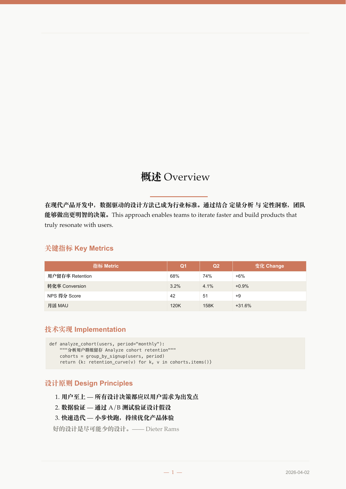 | 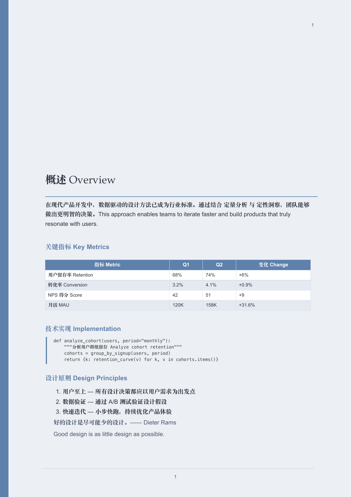 | 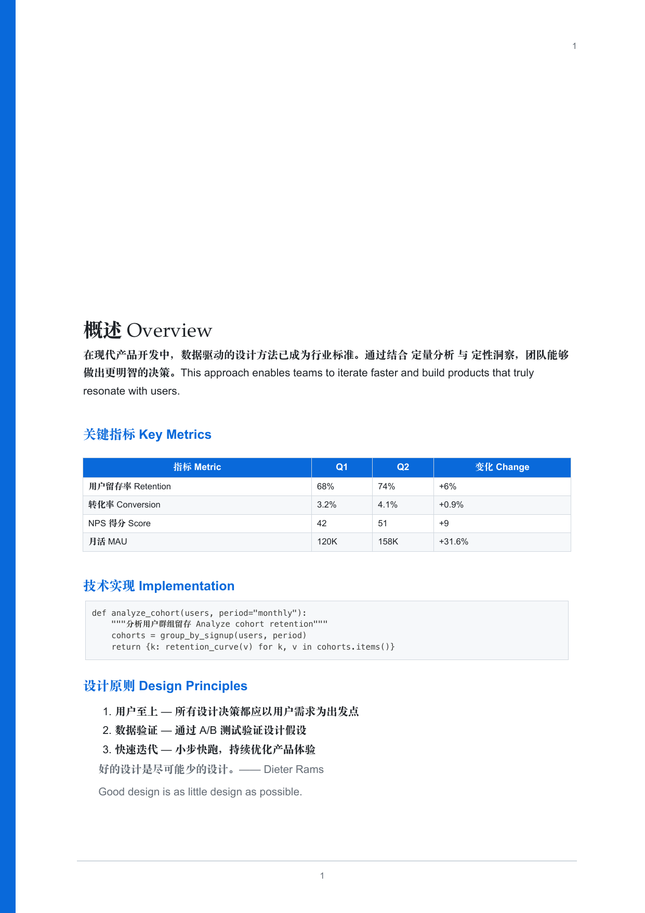 | 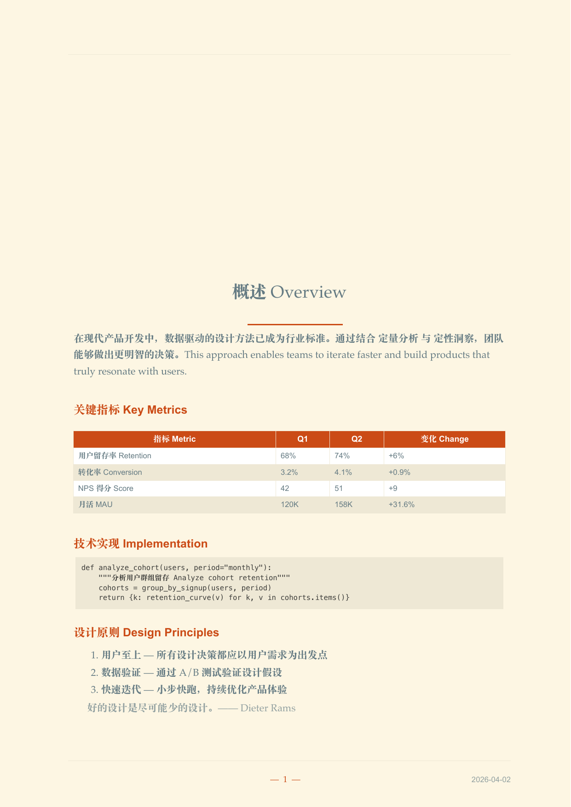 |

| paper-classic | ocean-breeze | tufte | classic-thesis |
|:---:|:---:|:---:|:---:|
| 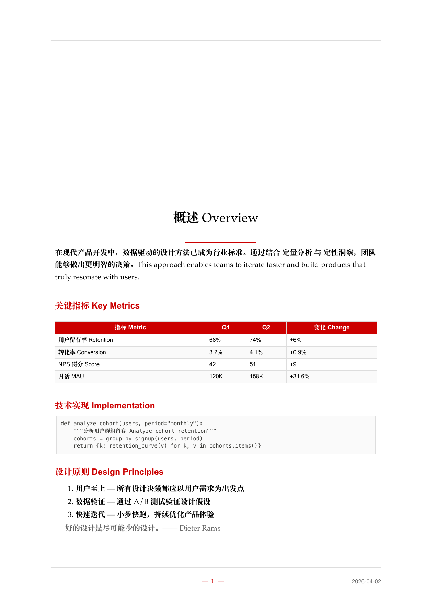 | 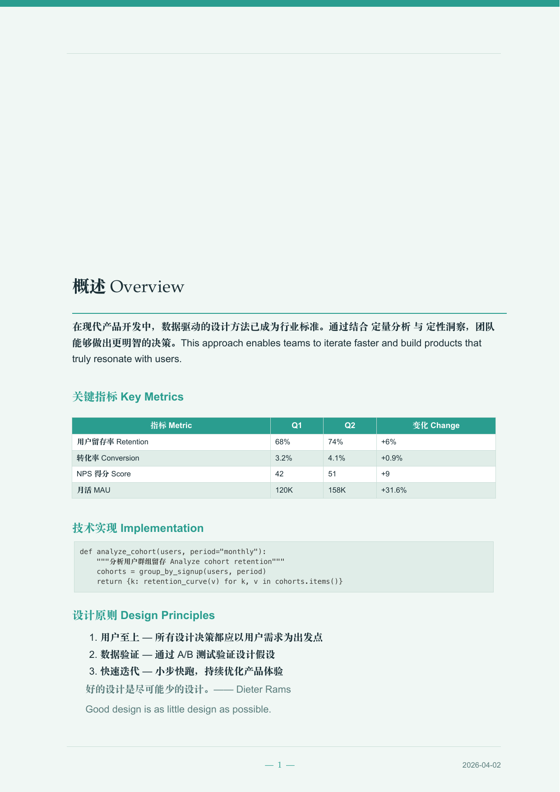 | 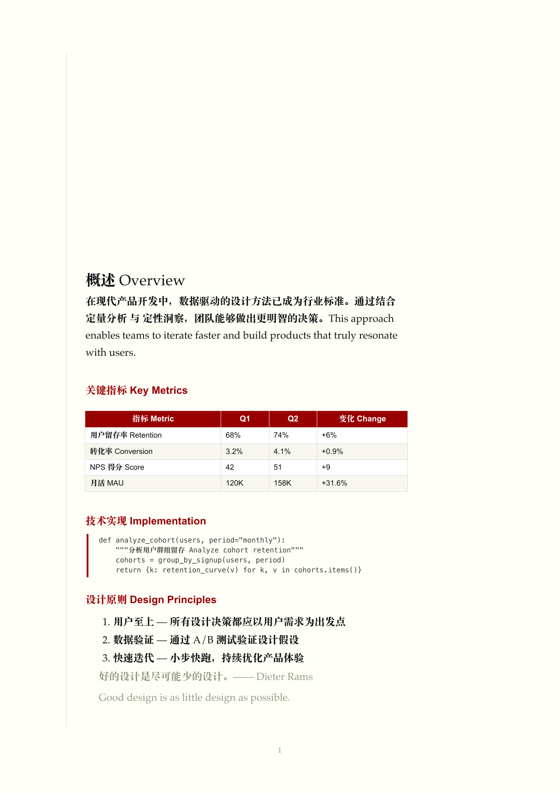 |  |

| ieee-journal | elegant-book | chinese-red | ink-wash |
|:---:|:---:|:---:|:---:|
| 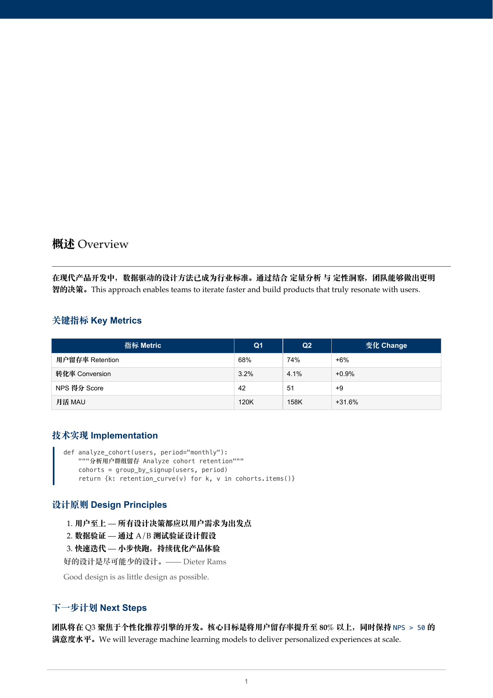 | 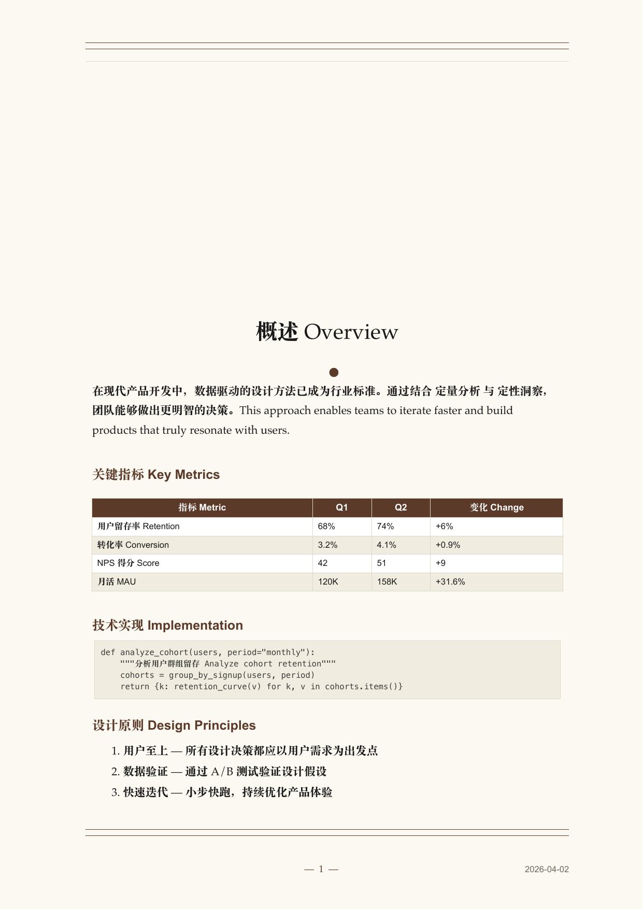 | 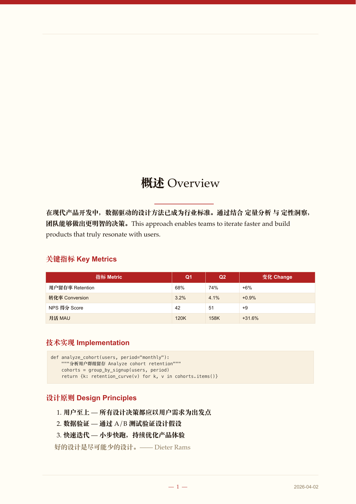 | 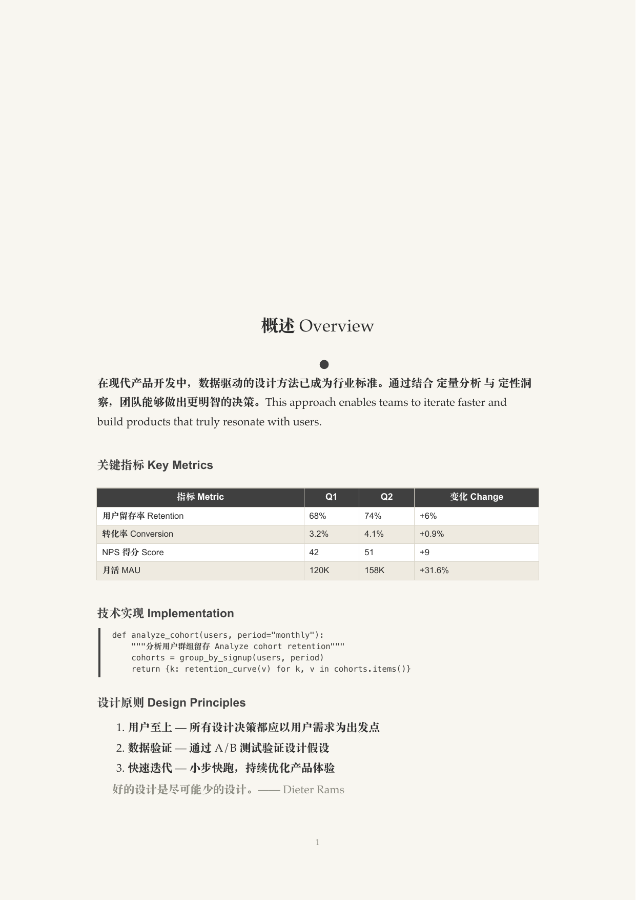 |

### Dark Themes

| monokai-warm | dracula-soft |
|:---:|:---:|
| 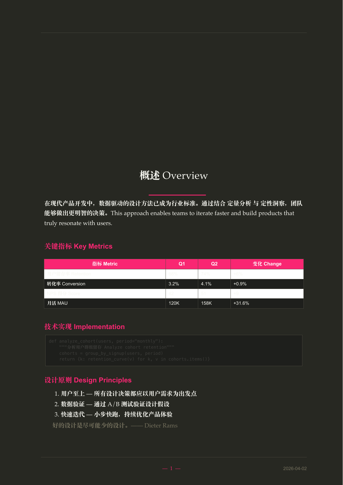 | 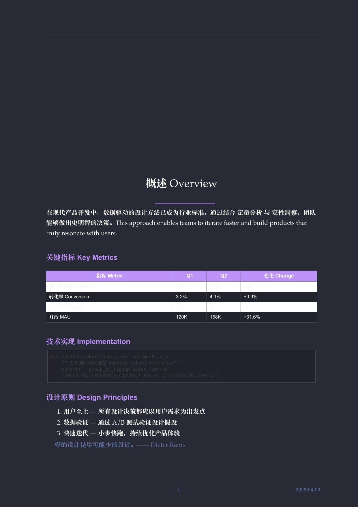 |

## License

MIT
