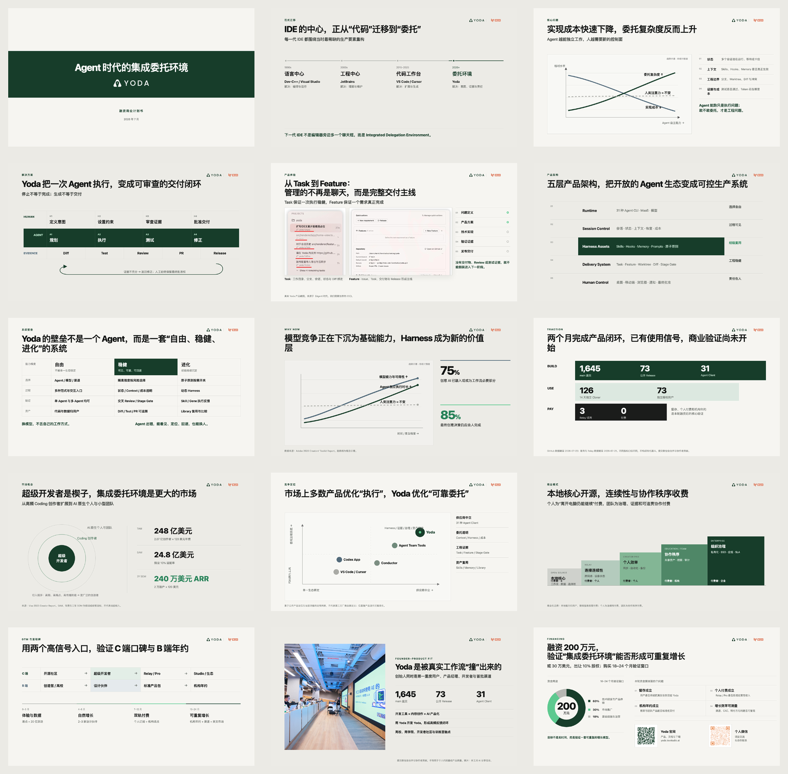

# Case: Yoda Seed BP

## Context

Yoda is an open desktop workspace for orchestrating AI coding work from intent to
delivery. The initial BP narrative accurately described technical capabilities, but
it made the company look narrower and more replaceable than the product ambition.

## Initial symptoms

- “多智能体编程工作台” was accurate but implementation-led.
- “让一个开发者指挥一支 AI 团队” made multi-Agent operation sound mandatory.
- “本地优先” could be misread as running models locally, despite cloud services,
  Relay, and model APIs.
- Worktree/branch behavior was elevated above broader product paradigms.
- The deck described features before defining the human need: reliably delegating
  creative work to AI.
- Early layouts had too many boxes and insufficient chart evidence.

## Reframing method

1. Separated product core from work modes.
2. Defined the early wedge (super developers), adjacent users (AI-native creators
   and teams), and long-term market.
3. Replaced implementation-first language with the human–AI relationship:
   Harness, delegation, evidence, approval, and creation.
4. Used an investor-readable category: “Agent 时代的集成委托环境”.
5. Built the story around the falling cost of implementation and the rising
   complexity of reliable delegation.
6. Kept commercial gaps visible: build/use evidence was separated from payment
   proof, and financing was framed as the window to validate retention, payment,
   institutional contracts, and measurable growth.

## Final 15-slide architecture

1. Integrated Delegation Environment.
2. IDE center moves from code to delegation.
3. Implementation cost falls while delegation complexity rises.
4. Execution becomes an auditable delivery loop.
5. Task to Feature manages complete delivery, not chat.
6. Five-layer product architecture.
7. System moat: freedom, robustness, evolution.
8. Why now: model capability becomes infrastructure; Harness gains value.
9. Build/use/pay evidence ladder.
10. Super developers as wedge; larger delegation market.
11. Reliable delegation vs. execution-only alternatives.
12. Open local core; continuity and collaboration are paid.
13. Consumer and institutional entry paths.
14. Founder–product fit.
15. Financing ask, use of funds, and 18–24 month validation window.

## Visual evolution

The final direction used warm white, deep Yoda green, large conclusion headlines,
real screenshots, simple sourced charts, and substantial whitespace. The cover was
reduced to a strong title and horizontal brand treatment. The final page used two
clearly separated QR codes for product and personal contact, then verified both from
the rendered slide.

## Reusable lessons

- Technical truth is not automatically an investable category.
- A narrow initial user does not have to cap the long-term market.
- Single Agent, multiple Agents, Agent teams, and worktrees can be product modes
  rather than the company definition.
- Honest zeroes can strengthen the financing thesis when the deck clearly states
  what the next capital will validate.
- Professional visuals require chart logic and final-image inspection; a polished
  template alone is insufficient.
