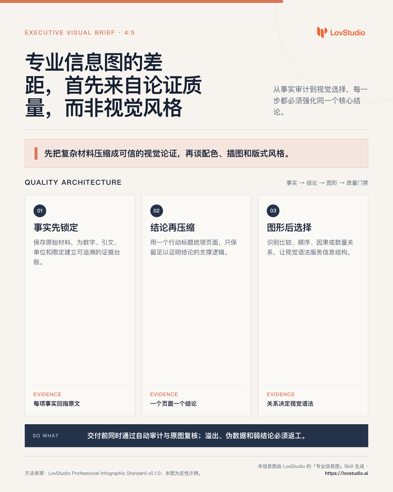

# lovstudio-professional-infographic


把当前上下文、研究结论或文档，转成咨询级专业信息图：先建立可辩护的视觉论证，再生成可编辑 HTML/SVG 与高清 PNG。

Part of [lovstudio general skills](https://github.com/lovstudio/general-skills) — by [lovstudio.ai](https://lovstudio.ai)

## 它解决什么问题

普通信息图生成器往往从“挑一个风格”开始，结果是装饰很多、结论很弱。本 Skill 从决策者需要理解的核心结论开始：

```text
原始上下文
    ↓
事实与证据审计
    ↓
单一核心结论 + 支撑逻辑
    ↓
匹配信息关系的视觉语法
    ↓
代码渲染的可编辑海报
    ↓
自动审计 + 原图视觉复核
```

默认路线是 HTML/CSS/SVG 代码渲染。图像模型只用于必要的无文字插图，所有标题、数字、图表、Logo 与来源均由代码排版。



## 质量标准

- 5 秒内看懂唯一核心结论；
- 3–7 个主要视觉模块，而不是文字卡片堆叠；
- 数字、单位、名称、引文与来源保持准确；
- 图表类型由信息关系决定；
- 无溢出、无占位文本、无 emoji、无“AI 渐变 + 随机装饰”；
- 右上角或右下角品牌 Logo；
- 明确标注由“专业信息图”Skill 生成；
- 交付 PNG、可编辑 HTML、内容 brief 和审计报告。

## 安装

```bash
git clone https://github.com/lovstudio/professional-infographic-skill \
  "${LOVSTUDIO_SKILLS_INSTALL_DIR:-$HOME/.agents/skills}/lovstudio-professional-infographic"
```

渲染 PNG 和执行浏览器审计需要：

```bash
python3 -m pip install "playwright>=1.45,<2"
python3 -m playwright install chromium
```

如本机已安装 Google Chrome，CLI 会在 Playwright 自带 Chromium 不可用时尝试回退。

## 使用

在支持 Agent Skills 的助手中直接说：

```text
把以上内容做成专业信息图
把这份研究整理成一张咨询风格的一页图
一图总结这个产品方案
Turn this into a professional infographic
Create a consulting-style visual summary
```

也可以直接使用 CLI：

```bash
SKILL_DIR="${LOVSTUDIO_SKILLS_INSTALL_DIR:-$HOME/.agents/skills}/lovstudio-professional-infographic"

python3 "$SKILL_DIR/scripts/infographic_cli.py" scaffold \
  --title "AI 时代的组织能力迁移" \
  --source report.md \
  --aspect 4:5 \
  --output-dir ./infographic-output

python3 "$SKILL_DIR/scripts/infographic_cli.py" render \
  --input ./infographic-output/poster.html \
  --output ./infographic-output/poster.png \
  --scale 2

python3 "$SKILL_DIR/scripts/infographic_cli.py" audit \
  --input ./infographic-output/poster.html \
  --image ./infographic-output/poster.png \
  --report ./infographic-output/audit.json \
  --strict
```

## 品牌配置

优先级：

1. CLI `--brand-profile`
2. `LOVSTUDIO_PROFESSIONAL_INFOGRAPHIC_BRAND_PROFILE`
3. `LOVSTUDIO_SKILLS_BRAND_PROFILE`
4. `${LOVSTUDIO_SKILLS_PROFILE:-$HOME/.lovstudio/skills/profile.json}`
5. 仓库自带的 LovStudio 公开品牌默认值

初始化自己的品牌：

```bash
python3 "$SKILL_DIR/scripts/infographic_cli.py" init-brand \
  --name "My Brand" \
  --logo "/absolute/path/to/logo.svg" \
  --primary "#1F2937" \
  --accent "#D97757" \
  --copyright "Generated by My Brand's Professional Infographic Skill"
```

默认写入：

```text
~/.lovstudio/skills/professional-infographic-brand.json
```

完整配置契约见 [`references/user-config.md`](references/user-config.md)。

## 产物

```text
infographic-output/
├── source.md       # 原始输入
├── brief.md        # 核心结论、支撑逻辑、证据台账
├── poster.html     # 可编辑源文件
├── poster.png      # 高清发布图
├── project.json    # 项目与品牌元数据
├── audit.json      # 自动质量审计
└── assets/
```

## 与常见方案的区别

| 方案 | 优点 | 主要风险 | 本 Skill 的处理 |
|---|---|---|---|
| 整图文生图 | 插画感强、速度快 | 文字、数字、图表不可控 | 只生成无文字辅助插图 |
| 固定模板 | 稳定 | 内容被模板牵着走 | 先定信息关系，再选视觉语法 |
| 声明式图表 | 数据结构清晰 | 单个图表不等于完整海报 | 放入结论、证据、品牌和来源的整体层级 |
| 自由代码排版 | 控制力强 | 容易缺少质量门禁 | 自动审计 + 原图复核 + 最多三轮修订 |

## 开源参考

- [AntV Infographic](https://github.com/antvis/Infographic)：声明式信息图与 SVG 渲染底座。
- [awesome-design-md](https://github.com/VoltAgent/awesome-design-md)：品牌设计令牌与 UI 风格档案。
- [baoyu-infographic](https://github.com/JimLiu/baoyu-skills/tree/main/skills/baoyu-infographic)：布局与视觉风格组合工作流。

这些项目提供了模板、语法或风格参考；本 Skill 重点补上咨询式内容建模、图表选择、文案预算、品牌落款和可验证质量门禁。

## License

MIT
